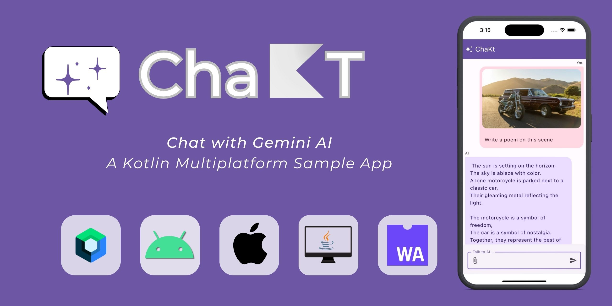

# Disclaimer  

The code in this repository has been originally developed and provided by the amazing **Shreyas Patil** (GitHub ID: [PatilShreyas](https://github.com/PatilShreyas)).  

### About Shreyas Patil:  
- 👦 **Google Developer Expert @Android**  
- 💼 **Senior Android Engineer @Deliveroo** (Ex - @Paytm, @ScaleReal)  
- 👨‍💻 Builds Mobile, Web apps, and Backend servers  
- ✍️ Shares insights and blogs at [blog.shreyaspatil.dev](https://blog.shreyaspatil.dev)  
- 🎵 & 🎹 Enthusiast  

We sincerely thank Shreyas Patil for his incredible contribution to the developer community. His work has inspired countless learners and practitioners in the field of Android development.  

### 📸 Relive the Moments:  
Couldn’t attend the session? Don’t worry!  
1️⃣ 📹 **Workshop Recording**: Watch the session and continue learning!  
🔗 [Recording Link](https://youtu.be/fPsLK-bwR3s)  

2️⃣ 📂 **GitHub Repository**: Access code and resources from the workshop.  
🔗 [GitHub Repo](https://github.com/GDG-OnCampusTMSL/Tech-Winter-Break--AppDev)  

3️⃣ 📸 **Event Photos**: Cherish the memories with our event highlights.  
🔗 [Photo Album](https://photos.app.goo.gl/HBLhvkx4Hy2X2RmY8)  

### 🎯 Huge Thanks:  
A heartfelt shoutout to:  
- **GDG on Campus Techno Main Salt Lake - Kolkata, India**  
- **GDG on Campus Nagesh Karajgi Orchid College of Engineering & Technology - Solapur**  
- **GDG on Campus Trinity College of Engineering and Research - Pune, India**  
and all our community members for making this workshop memorable!  

### Contribution Guidelines  
While this repository welcomes contributions, please refer to [CONTRIBUTING.md](CONTRIBUTING.md) for guidelines before raising a Pull Request (PR).  

Thank you for your interest and enthusiasm for this project. Let’s continue to learn, build, and grow together! 🚀  


# ChaKt - Chat with AI 💬✨

[](https://github.com/PatilShreyas/ChaKt-KMP/actions/workflows/build.yml)



ChaKt is a multiplatform app built using Kotlin and Compose Multiplatform to demonstrate the use of
[***Generative AI SDK for Kotlin Multiplatform***](https://github.com/PatilShreyas/generative-ai-kmp) to generate content using Google's Generative
AI
models. It features a simple chat based user interface and experience to interact with AI.

## Download / View App ⬇️

| Platform    | Action                                                                                                                                                                                                                                                                                                                                                                                                                                                                                                                                  |
|-------------|-----------------------------------------------------------------------------------------------------------------------------------------------------------------------------------------------------------------------------------------------------------------------------------------------------------------------------------------------------------------------------------------------------------------------------------------------------------------------------------------------------------------------------------------|
| 📱 Mobile   | [](https://github.com/PatilShreyas/ChaKt-KMP/releases/latest/download/chakt-android.apk)                                                                                                                                                                                                                                                                                                                                                            |
| 🖥️ Desktop | [](https://github.com/PatilShreyas/ChaKt-KMP/releases/latest/download/chakt-windows-x64.jar) [](https://github.com/PatilShreyas/ChaKt-KMP/releases/latest/download/chakt-macos-x64.jar) [](https://github.com/PatilShreyas/ChaKt-KMP/releases/latest/download/chakt-linux-x64.jar) |
| 🌎 Web      | [](https://patilshreyas.github.io/ChaKt-KMP)                                                                                                                                                                                                                                                                                                                                                                                           |

Check [releases](https://github.com/PatilShreyas/ChaKt-KMP/releases) for more information on app versions. 

## Preview ▶️

In the below video:
- 1. _Running on Chrome browser_
- 2. _Running on MacOS desktop_
- 3. _Running on iPhone 15 Simulator_
- 4. _Running on Android Emulator_

https://github.com/PatilShreyas/ChaKt-KMP/assets/19620536/bf661cac-b7ce-4f97-ab0d-7c1fdb3ed35f

<details>
  <summary>Screenshots</summary>

#### Mobile App (Android & iOS)

   

#### Desktop App

   

#### Web App

   
  
</details>

## Built with 🛠️

- [Kotlin Multiplatform](https://kotlinlang.org/lp/multiplatform/)
- [Kotlin Coroutines](https://github.com/Kotlin/kotlinx.coroutines)
- [Compose Multiplatform](https://www.jetbrains.com/lp/compose-multiplatform/)
- [Generative AI SDK](https://github.com/PatilShreyas/generative-ai-kmp)
- [Calf - File picker](https://github.com/MohamedRejeb/Calf)
- [BuildKonfig](https://github.com/yshrsmz/BuildKonfig)

## Development 🛠️

### Pre-requisites

- Java JDK 17+
- Latest stable version of Android Studio IDE
- Latest XCode (_for iOS_)
- Gemini API Key (_Get it from [here](https://makersuite.google.com/app/apikey)_)

### Setup

- Clone this repository.
- Open in the _latest version_ of Android Studio.
- Place your Gemini API key in `local.properties` file as `gemini_api_key` property.

Example:

```properties
gemini_api_key=YOUR_API_KEY
```

- Run the app on your device or emulator:
    - For Android, run `composeApp` module by selecting `app` configuration.
    - For iOS, run `composeApp` module by selecting `iosApp` configuration.
    - For Desktop, run `./gradlew :composeApp:run`
    - For Web, run `./gradlew :composeApp:wasmJsBrowserDevelopmentRun`

## Contributing 🛠️

Please read [CONTRIBUTING.md](CONTRIBUTING.md) for details and the process.

